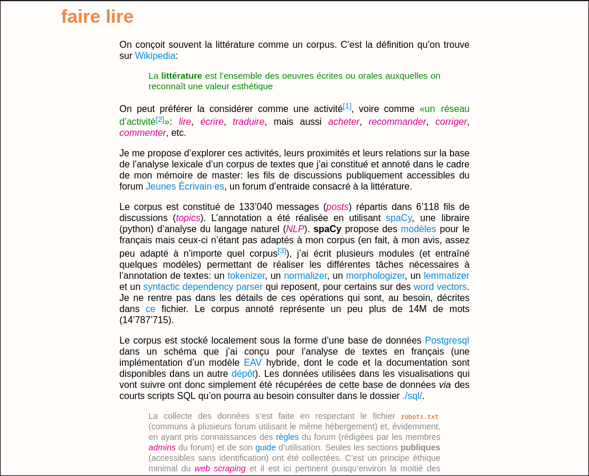
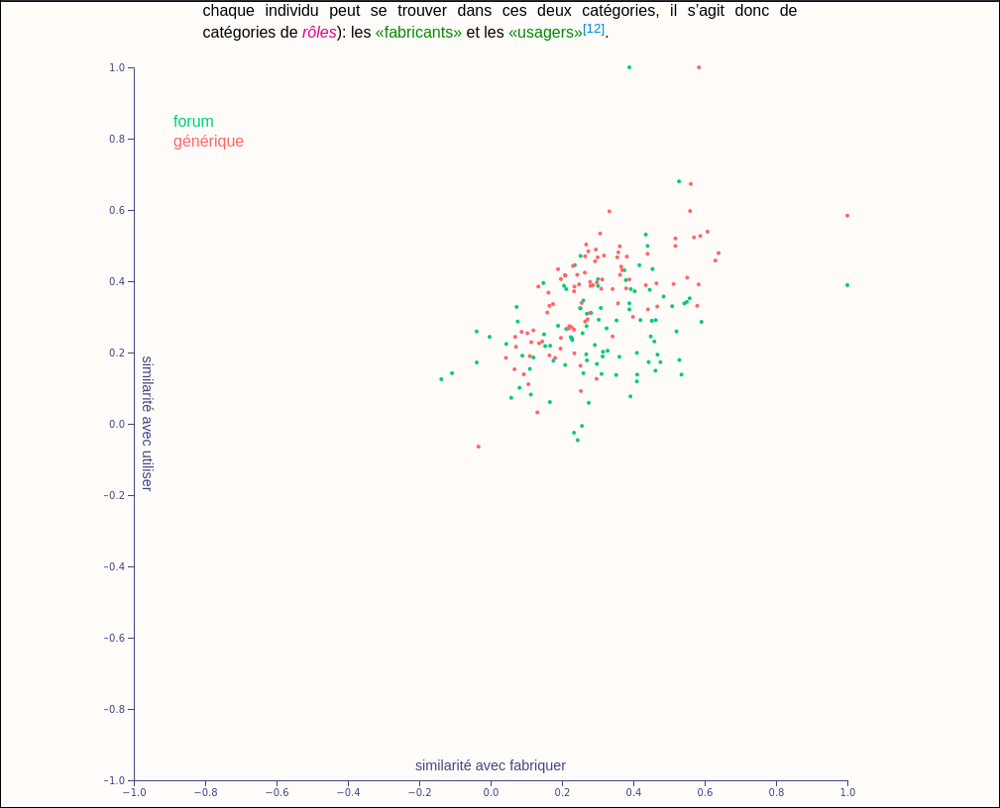
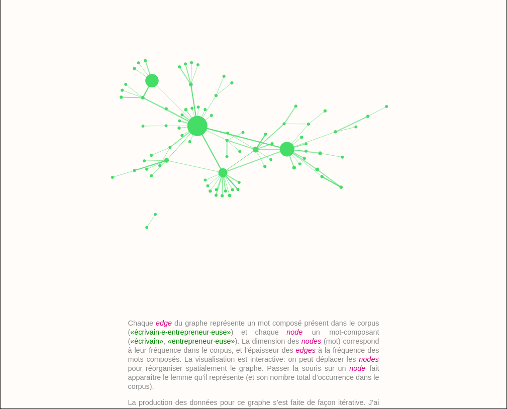

faire lire
==========

Explorer, à l'aide de la librairie [d3.js](https://d3js.org/), les données issues d'un forum d'entraide consacré à la littérature, et essayer de voir ce que ces données peuvent apporter à une conception de la littérature comme _réseau d'activités_.

Ce dépôt, réalisé dans le cadre de l'enseignement [_Visualisation de données_](https://github.com/ipante/ressources_visualisation_de_donnees) dispensé à l'université de Lausanne par Isaac Pante, aborde les nombreuses activités et les nombreuses personnes qui prennent part à l'écriture ou à la lecture littéraire. Car à n'importe quelle activité d'écriture, ou presque, contribuent de multiples acteur·rices, et c'est le cas de l'écriture de ce dépôt:

- Les fichiers HTML ont été générés à l'aide de [Pandoc](https://pandoc.org/) à partir de fichiers Markdown, d'un [template](./pandoc/template.html) HTML et d'une bibliographie au format CSL-JSON (tout est dans le dépôt, y compris la [commande utilisée](./generer-html.sh)).
- Les fichiers `.js` sont mis en forme à l'aide du programme [js-beautify](https://github.com/beautifier/js-beautify). Le fichier de configuration est [./.jsbeautifyrc](./.jsbeautifyrc)).
- Tous les fichiers ont été édités à l'aide de l'éditeur [Neovim](https://neovim.io/) en utilisant le _Language Server Protocol_ pour javascript [quick-lint-js](https://quick-lint-js.com/docs/lsp/).

documentation
-------------

La documentation (qui porte sur la production des données et des visualisations) est intégrée aux fichiers HTML.

usage
-----

Pour voir (et interagir) avec les visualisations, il faut utiliser un _server live_. On pourra en installer un comme ceci:

```bash
nmp install -g live-server
```

La page principale est le fichier `home.html`, c'est donc lui qu'il faut ouvrir dans le `live-server`.

```bash
git clone https://github.com/thjbdvlt/faire-lire
cd faire-lire

live-server --entry-file=home.html --browser=firefox
```

navigateur
----------

Le dépôt a été conçu en utilisant le navigateur [Firefox](https://www.mozilla.org/en-US/firefox/115.0/releasenotes/) (version `115.14.0esr`).

screenshots
-----------






